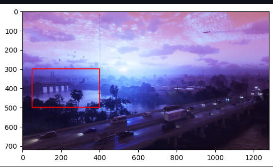

<h1> Processing Images & Videos - Python Project</h1>
 
<h2>Features</h2>
<li>Reading an image</li>
<li>Extracting the RGB values of a pixel</li>
<li>Extracting the Region of Interest (ROI)</li>
<li>Resizing the Image</li>
<li>Rotating the Image</li>
<li>Displaying text/li>

<h2>Acknowledgments</h2>

<b> Python3: http://bit.ly/python3-certifications <b>
 

<h2>Photo</h2>

 

<h2>Contact</h2>

<b> Email: mariusc0023@gmail.com </b>
